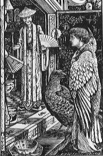

#Hrdlička ve schránce

To ráno jsem jako vždy vybíral poštovní schránku. A mezi věcmi tam obvyklými (upomínkami za nezaplacené připojení k telekomunikační síti, mezi dopisy od nakladatele a reklamami) mě tam překvapila jedna neobvyklá - zraněná hrdlička. Seděla v rohu schránky a tiše vrkala. Došel jsem domů pro nějaké zrní a nasypal jsem jí ho do schránky.

Doma jsem si pak zjišťoval na internetu, co je zač. Popravdě řečeno jsem neuspěl, vypadalo to, že je to nějaký cizokrajný druh, který uletěl chovateli. Nakonec jsem se spokojil s radou z jednoho ornitologického fóra, kde jsem se ptal, čím mám krmit tenhle neznámý druh.

A tak plynuly týdny. Chodil jsem do práce, platil jsem telefon, komunikoval s nakladatelem, jako obvykle. Ale přece bylo něco jinak. Ve schránce mi žila hrdlička.

Každé ráno jsem se těšil z její přítomnosti. Otevíral jsem schránku a už jsem slyšel její vrkání. Popravdě řečeno jsem se na ní těšil, a to že hodně.

Hodiny v práci byly už z toho těšení celé okoukané, jejich ručičky se z toho neustálého koukání ztrácely před očima.

Takhle jsem žil s hrdličkou v kastlíku. Nosil jsem jí zrní a ona na mě něžně vrkala. A bylo mi dobře.

Ale mělo to i svou stinnou stránku. Ničila mi dopisy. Žila ve schránce a na mých dopisech to bylo znát. U reklam mi to nevadilo vůbec, upomínky od operátora jsem měl na paměti, tak nebyl důvod proč je číst. U některých dopisů z nakladatelství mě to trochu mrzelo, ale dalo se to snést. Horší bylo, když jsem místo očekávaného potvrzení pro berňák našel ve schránce jen směs peří, papíru a trusu.

To byl průšvih, protože smrti a daním nikdo neuteče. Hrozně jsem se na hrdličku zlobil a už jsem uvažoval, že jí ze schránky vyženu, ale pár dní na to přišla upomínka od pošty. To, co hrdlička prve zničila, nebyl samotný dopis, ale jen doručenka. Dopis sám byl totiž do vlastních rukou.

Odpustil jsem, ale bylo mi jasné, že nemůže žít ve schránce navěky.

Uplynul další týden. Jezdil jsem do práce, psal jsem nakladateli a zapomínal platit telefon. Až jednoho dne jsem přivezl z města klec.

Trvalo mi další den, než jsem se odhodlal ji použít. Člověk nemůže žít jen ve schránce a hrdlička rovněž ne, to mi bylo jasné.

Když jsem se pokoušel dostat hrdličku z klece, uvědomil jsem si podivnou věc. Jak se vůbec dostala do schránky? Otvor na dopisy se zdál příliš malý na to, aby jím prošla dobře živená hrdlička. Nezbylo mi tedy nic jiného než dojít pro nářadí a pokusit se rozmontovat schránku.

To mi trvalo celou věčnost. Něžné vrkání se mezitím měnilo ve zlověstné pískání a děsivé ticho. Postupoval jsem však opatrně, a tak jsem se hrdličky nářadím ani nedotkl.

Když se mi pak podařilo odmontovat jednu ze stěn, stala se překvapivá věc. Hrdlička vzlétla a zmizela mi ve tmě. Ten večer jsem si myslel, že už hrdličku nikdy neuvidím, že už její vrkání nikdy neuslyším.

Druhý den byla sobota. Uklízel jsem v zádveří, bylo už na čase, některé pavučiny už slavily výročí. A najednou jsem to slyšel - vrků, vrků. Na schránce seděla hrdlička.

Od té doby ji občas potkávám. Přilétá na schránku a vrká a já jí sypu slunečnici a ptačí zob. Dopisy jsou už v bezpečí. Reklamy vyhazuju, upomínky ignoruju a v nakladatelství už mi vydali jednu knihu.

Přemýšlím o tom, že bych si do té klece pořídil kanára. Jsou to prý strašně vděční tvorové, stačí na ně jen pohlédnout a začnou krásně zpívat.

Taky přemýšlím o jednom dni. O dni, kdy se vrátím z práce a na schránce budou sedět hrdličky dvě. Možná ji ten den uvidím naposledy, ale nebude mi to líto.

*Vrků.*

---
