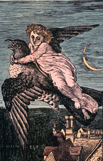

# Věnování

*Chtěl jsem jen napsat pár veršíků  
pro sebe a pro kukačku.*

---

# Předmluva autora

Ti, co mě znají, vědí, jak špatně jsem na tom s časem. V čase se neorientuji, nevím dne ani hodiny, a tři týdny jsou pro mě to samé jako tři měsíce.

To bylo tenhle nebo minulý rok, to už nevím, - seděl jsem si to takhle nevinně v práci a najednou jsem se najel myší na hodiny a v bublince se objevilo datum. Jé, já mám dnes narozeniny! Uvědomil jsem si překvapeně…

O několik měsíců nebo let později, teď už nevím, jsem vymyslel skvělý plán - založím si nakladatelství!

K tomuhle nápadu se záhy přidal ještě jeden - vystřelím si při té příležitosti z jedné literární kritičky, která mi na jistou dobu docela zamotala hlavu. Ano, tohle (*rozuměj sbírka, kterou právě čtete*) by ji mohlo trošičku naštvat. Chachacha!

I počal jsem realizovati svůj ďábelský plán - dvě noci jsem strávil nad počítačovou klávesnicí - kopíroval jsem obsah, ladil jsem vzhled a vybíral ilustrace. Pak jsem přidal velice neosobně znějící tiskovou zprávu, odeslal jsem to na e-mail zmíněné kritičce a děj se vůle boží…

Následující ráno jsem opět nevinně seděl v práci. Přihlásil jsem se do systému a hele - „*Dnes je Středa 04. únor 2015, svátek má Jarmila*“ - no to je náhodička. Ničeho zlého netuše jsem se dále věnoval plnění služebních povinností. Až doma mi to došlo.

A tak jsem omylem daroval jedné literární kritičce dárek k svátku, vydal sbírku zamilovaných básní a založil nakladatelství.

---

