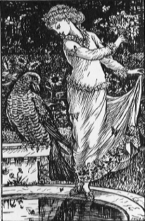

#Pod vlivem

serotoninu, dopaminu a Kukačky 

##Samota mezi lidmi

Ach, jak ten pocit znám,  
už zase jsem v tom stavu,  
kdy připadám si sám,  
v metru uprostřed davu.  
  \
Les dal by možná klid mi  
samota mezi lidmi. 

##Potěmkináda

pocit, ten zůstává, důvod se mění  
letectvo z papíru na stole není  
  \
a venku z kotelny  
stoupá tu nad domy  
bílý kouř vysoko do výšky  
  \
a kanclem obchází  
jak černý svědomí  
Verča, ta ve svetru s koníčky  
  \
dneska jsem pochopil, co mi tak schází  
asi tak tři až pět pitomejch frází   

##Zvlástní

Zkouška sirén  
A manželský hádky se ženou,  
co vlastně není moje manželka  
A vlastně mě ani nechce  
A já ji vlastně taky ne  
  \
Jen se tak známe  
Ne, my se vlastně ani neznáme  
Jen do očí si koukáme  
Ale ty oči vlastně nevidíme  
  \
Vlastně nevlastní  
Zvlástní   

##Kdeže

A noční město pomalu usíná  
jen hučí auta na Barrandovským mostě.  
A pár z těch oken se zhasíná  
a mám chuť zeptat se kdo jste?  
  \
V kterém z oken je tahleta  
Princezna moje zakletá?   

##Výstižna

Ať se snažíš, jak se snažíš,  
lásku z hlavy nevyrazíš,  
ani chlastem, ani prací,  
pořád se ti mrcha vrací.   

##Možná

Možná nejsem třicátník finančně zajištěnej,  
možná zatím nechci dítě a možná ani štěně,  
možná, že to se mnou nemá žádnou budoucnost,  
přesto jsem ti nejbližší a to je víc než dost.  
  \
Možná nejsem svalovec, co stěhuje stoly,  
možná nemám diplomy, tituly a školy,  
že jsem toho hodně řekl může se vám zdát  
však rád bych dodal dodatek: Prostě Tě mám rád.   

##Modrý plamen

Čekání do noci na krásku  
Která stejně nakonec nepřijde  
Podivná tahle hra na lásku  
Vysněné setkání nikdy mi nevyjde  
  \
Jen modrý plamen hoří tu do noci  
Že srdce hořelo - není mi pomoci   

##Výlet za čáru

Výlet za tenkou čáru  
hranici všedních dní.  
Já vážně nemám páru,  
zda nebyl poslední...  
  \
Víckrát už tam totiž nepudu!  
Je to trochu totiž vo hubu!  
Víckrát už tam totiž nevlezu!  
A stejně zas plot ten přelezu...  
  \
Za ostnatým drátem červených růží.  
Víří tam bubny vonící kůží.  
Kůží ze sprchy, mokrými vlásky.  
Jsem Stalker co zas leze do Pásma lásky.  

---
