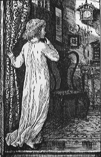

# Pro kukačku

## Nad červenajícími plody jabloní

Nad červenajícími plody jabloní,  
slunce pomalu nebem klouzá  
až pak za obzor hlavu zakloní,  
bytem potichu hraje Prouza.  
  \
O půl sedmé už nám končí dny  
a dál se pomalu a jistě krátí.  
Přijde k nám zima a oslavy tmy,  
a pak se slunko do jara vrátí.  
  \
Přesně tak, jak to mám ve zvyku,  
zákazu vstupu míjim značku.  
Chtěl jsem jen napsat pár veršíků  
pro sebe a pro kukačku.  

## Viděl jsem nad řekou

Viděl jsem nad řekou labutě letící  
ve výši topolů nad vodou lesknoucí.  
  \
Letěly v párech a v párech se míjely,  
labutě bílé, co po vodě přijely.  
  \
Taky bych někdy chtěl křídlama zamávat  
po vzoru labutí nad řekou lítávat.  
  \
Labuť však křídla má a člověk je nemá  
alespoň dokud mu láska je nedá.   

## Tak co mi brání

Hlavu mám plnou,  
cizích slov.  
Krakow glowny osobowy,  
Dresden hauptbahnhof.  
  \
Veliká dálka,  
za každým slovem tím,  
mě ale láká jen  
Železná Ruda - Alžbětín.  
  \
Pro vrchní cukřenku,  
velikou kytici,  
zpáteční jízdenku,  
po dva dny platící.  
  \
Když to tak snadné je,  
tak co mi brání,  
chytit nejbližší vlak,  
vyrazit za ní.  
  \
Je tu jen pár zlých hlasů,  
zůstat mě nutí,  
peníze, málo času,  
strach z odmítnutí.   

## Co mě tak láká?

A ty se ptáš,  
co mě tak láka, na tobě?  
Odpoveď máš  
tady i když v snivé podobě  
  \
Dostal jsem ochutnat  
z poháru štěstí.  
Je to jak tancovat  
na poušti v dešti.  
  \
Rychle mi však došlo,  
že byl to jen sen  
Nad pouští slunce vyšlo  
a zase další horký den.  
  \
Tak buď mi oázou,  
do které toužím jít.  
Pouští mé kroky jdou,  
mám žízeň, musím pít.  
  \
I kdybys byla jen fata morgána,  
tak dáváš mi směr.  
Oslovit můžu pak, to slunce nad náma:  
Jen do mě si per!  

## Koupel při měsíčku

Já zazpívám vám písničku  
o koupání při měsíčku.  
O únorovém osvěžení  
ve společnosti krásné ženy  
  \
Tam, kde ve dne stojí rybáři,  
se naše těla v rybník ponoří.  
  \
Romantická koupel v páru,  
vypouštíme z úst svých páru  
a ač je kolem celkem chlad,  
nás hřeje láska, vášeň snad.  
  \
A stékaj kapky rozechvělě  
po jejím krásném bílém tělě.  
Ubohá rusalka bledá,  
*tohle si za rámeček nedá.  
  \
Že kvůli jejím krásnejm vočím  
do ledový tříště skočím.  
Pára mi jde kolem huby,  
drkotaj mi zimou zuby.  
  \
Romantický hovadiny  
a mě modraj končetiny.  
Co jsem to za milovníka?  
Klepu se tu jak osika.  
  \
Pro nesmyslný přání ženy,  
asi skončím zamražený.  
Tady jde vo zdraví.*  
Láska vše napraví.  
  \
Pro lásku se obětovat  
a city svoje opětovat.  
My zahřejem se v objetí  
a všechna zima odletí.  

CINK! 

## Má to vůbec cenu?

Teď už vím já, za čím se to ženu.  
A tak se ptám, má to vůbec cenu?  
  \
Už vnímám, marnou svoji snahu.  
A tak se ptám, má to vůbec váhu?  
  \
Má to vůbec váhu a má to vůbec cenu?  
Proskakovat ohněm a brodit se ve sněhu...  
  \
Má to vůbec cenu, pokračovat dál,  
když po sólovém partu, mi tleská prázdný sál.   

## Pevný bod

dejte mi pevný bod  
já pohnu zemí  
však nemám důvod  
nechce se mi  
  \
nač se vlastně pořád snažit?  
když ještě něco můžu zkazit...  
nechci toho nechat radši?  
na co žít, když dýchat stačí?  
  \
tak takhle jsem to v hlavě míval,  
než přišel náhlý citů příval  
než slyšel jsem tvůj hebký hlas  
než přečet' jsem tvůj první vzkaz  

## Zas to sklo

Anička zas usíná v autobuse,  
mně sladká slůvka hořknou v puse.  
Zas padá jí hlava na boční sklo  
a mně se náhle zastesklo.  
  \
Po očích, co jsem neviděl,  
po hlase, co jsem neslyšel,  
po věcech, co jsem nezažil,  
po citu, který jsem si vysnil. 

## Pomalý dny a rychlý noci

Zas se všední den pomalu vleče  
jako když rozžhaven asfalt teče.  
Zase čas večerní kupředu pádí  
jako proud dešťový ve vyschlém vádí.  
  \
||: *Pomalý dny a rychlý noci  
splněný sny a divný pocit* :||  
  \
V poslední době nechodím spát  
to kvůli tobě, tak tě mám rád,  
že v noci bdím a ráno pak zívám.  
Už dávno vím, už dávno vnímám  
  \
||: *ty rychlý noci a pomalý dny  
ten divnej pocit a splněný sny* :||  

## Senzorická deprivace

Tak dlouho jsem byl sám  
vystavený tmám  
že sám sebe se ptám  
zda nejsi jenom klam.  
  \
Chci přivonět k tvým vlasům  
a ochutnat tvé rty  
obejmout tě v bocích  
slyšet tvé srdce bít.  
  \
Pak ztratit se v tvých očích  
svým vlastním pohledem  
a ochutnat ten pocit  
co láska dovede.   

## Jen si mě utop

Jen si mě utop, rusalko, tam, v tom tvém rybníce.  
Po ničem víc už netouží už mé srdce.  
Než s tebou shořet, ve vodě se utopit,  
A pak se druhý den po boku tvém probudit.  

## Infinitivní

Šeptat nebo řvát?  
Chtěl bych se teď ptát.  
  \
Brečet nebo smát  
z toho, že mám rád?  
  \
Vždyť je o co stát   
nebo není snad?  

## Óda pro duši

Kraťoučký šatičky,  
nádherný nožičky,  
růžový tvářičky,  
to všechno máš.  
  \
Ódy na vlásky,  
vyznání lásky,  
tyhlety písničky  
nazpaměť znáš.  
  \
A smečku ctitelů,  
jedno však ruší:  
pro krásu těla  
oni nevidí duši.  
  \
Nesklidí básník,  
nesklidí díků.  
Za asi milióntou  
oslavu tvých rtíků.  
  \
Ať zmuchlá papír  
a začne znova.  
A místo rtíků tvých,  
oslaví tvoje slova.  
  \
A místo nohou,  
zas tvoje kroky.  
A vůbec - nemusí  
ti tak zobat z ruky.  
  \
Názory vlastní, ať si udělá  
ať nedělá z tebe jen anděla.  
  \
Kdo s tebou půjde  
v dobrém i ve zlém  
ten si tě v jeden  
krásný den vezme.  
  \
Můžete spolu pak v lásce žít  
a ty čtyři děti budete mít.   

---

